# Comprehensive Stock Analysis Dashboard Architecture

## Authentication Flow
- Implement AWS Cognito integration for seamless user management
- Create responsive sign-up/sign-in modals with password recovery
- Persistent session handling with JWT tokens

## Landing Page
- Hero section with value proposition for fundamental analysis
- Interactive demo of key features (screener tool, financial ratios)
- Testimonials from professional investors

## Dashboard UI Redesign (`/overview/*`)
### Navigation System
- Collapsible sidebar with intuitive icons (Watchlist, Screener, Reports, Settings)
- Global search bar with typeahead suggestions and multi-exchange filtering
- Dark mode toggle integrated into user profile dropdown

### Data Visualization Hub
- Central interactive chart area with timeframe selector (1D/1W/1Y/MAX)
- Financial metric cards with sparklines (P/E ratio, ROIC, Debt/Equity, FCF)
- Comparative analysis panel for industry benchmarking

### Information Architecture
- Tabbed interface for financial statements (Income, Balance Sheet, Cash Flow)
- News sentiment tracker with AI-generated summaries
- Valuation models section (DCF, Graham Formula, Dividend Discount)
- **Removed Portfolio Tracking** (as specified)

### Professional UI Elements
- Adaptive grid layout with draggable/resizable widgets
- Contextual tooltips explaining financial terminology
- Data density controls with summary/detail view toggle
- Performance heatmaps for sector comparison
- Export functionality for reports (PDF/CSV)

## SaaS Design Principles
- Atomic design system with consistent typography hierarchy
- Micro-interactions for data updates and state changes
- Accessibility-compliant color schemes (WCAG 2.1)
- Skeleton loaders for data-intensive components
- Empty states with actionable guidance

## Implementation Phases

### Phase 1: Foundation
1. **Auth Implementation**:
   - Integrate AWS Cognito with JWT token handling
   - Create auth modals (sign-up/sign-in/password recovery)
   - Implement session persistence

2. **Landing Page**:
   - Create `/landing` route with hero section
   - Build interactive feature demo component
   - Add testimonials section

### Phase 2: Dashboard Core
3. **Navigation System**:
   - Implement collapsible sidebar with intuitive icons
   - Create global search with typeahead suggestions
   - Enhance dark mode toggle in profile dropdown

4. **Data Visualization**:
   - Add timeframe selector to ChartComponent
   - Create FinancialMetricCard component with sparklines
   - Build comparative analysis panel

### Phase 3: Financial Analysis
5. **Information Architecture**:
   - Implement tabbed financial statements (Income/Balance Sheet/Cash Flow)
   - Create NewsSentimentTracker with AI summaries
   - Add ValuationModels section (DCF/Graham/Dividend Discount)

6. **Professional UI**:
   - Integrate react-grid-layout for adaptive grids
   - Add contextual tooltips for financial terms
   - Implement PDF/CSV export functionality

### Phase 4: Refinement
7. **SaaS Principles**:
   - Complete atomic design system documentation
   - Add micro-interactions for state changes
   - Ensure WCAG 2.1 compliance
   - Implement skeleton loaders for data-heavy components

8. **Mobile Responsiveness**:
   - Optimize all components for mobile using CSS Grid/Flexbox
   - Implement responsive data density controls

## Technical Stack Enhancement
- **Recharts** → Extend for financial visualizations
- **Styled Components** → Create theme extensions for dark mode
- **React Query** → Add for data fetching and caching
- **PDFKit** → Integrate for report generation

## Diagrams

### Architecture Overview

```mermaid
graph TD
    A[Authentication Flow] --> B[Cognito Integration]
    A --> C[Auth UI Components]
    A --> D[JWT Session Handling]
    
    E[Landing Page] --> F[Hero Section]
    E --> G[Interactive Demo]
    E --> H[Testimonials]
    
    I[Dashboard Redesign] --> J[Navigation System]
    I --> K[Data Visualization Hub]
    I --> L[Information Architecture]
    I --> M[Professional UI Elements]
    
    J --> N[Collapsible Sidebar]
    J --> O[Global Search]
    J --> P[Dark Mode Toggle]
    
    K --> Q[Interactive Charts]
    K --> R[Financial Metric Cards]
    K --> S[Comparative Analysis]
    
    L --> T[Financial Statements]
    L --> U[News Sentiment]
    L --> V[Valuation Models]
    
    M --> W[Adaptive Grid]
    M --> X[Contextual Tooltips]
    M --> Y[Export Functionality]
    
    Z[SaaS Principles] --> AA[Atomic Design System]
    Z --> AB[Micro-interactions]
    Z --> AC[Accessibility]
    Z --> AD[Skeleton Loaders]
```


### Implementation Timeline
```mermaid
gantt
    title Implementation Timeline
    dateFormat  YYYY-MM-DD
    section Foundation
    Auth Flow       :a1, 2025-06-26, 3d
    Landing Page    :a2, after a1, 2d
    
    section Dashboard
    Navigation      :b1, after a2, 2d
    Visualization   :b2, after b1, 4d
    
    section Financial
    Statements      :c1, after b2, 3d
    Valuation       :c2, after c1, 3d
    
    section Polish
    UI Elements     :d1, after c2, 3d
    Responsiveness  :d2, after d1, 2d
    Testing         :d3, after d2, 3d