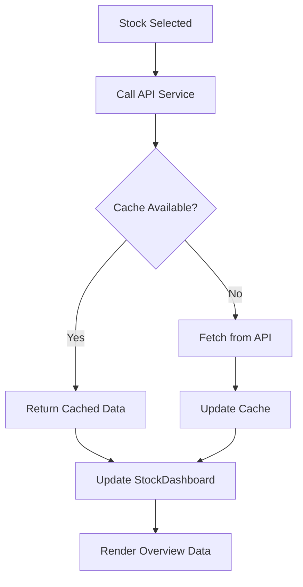
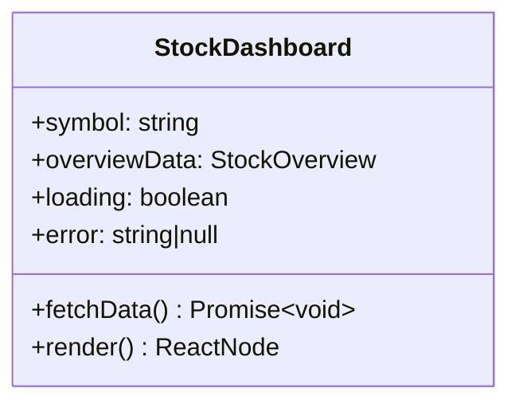

# ASIC Margin Trading Platform Architecture

## Frontend Workflow: Stock Overview Data Fetching

### Design Overview
This section documents the frontend workflow for fetching and displaying stock overview data when a stock is selected from search results.



### Key Components

#### 1. API Service (`frontend/src/services/api.ts`)
```typescript
export const fetchStockOverview = async (
  symbol: string,
  forceRefresh: boolean = false
): Promise<StockOverview> => {
  // Cache implementation with 5-minute expiration
};
```

#### 2. StockDashboard Component (`frontend/src/components/StockDashboard.tsx`)


#### 3. State Management (`frontend/src/App.tsx`)
```typescript
// Using React Context API
const StockContext = createContext({
  selectedStock: null,
  overviewData: null,
  loading: false,
  error: null,
  fetchOverview: async () => {}
});
```

#### 4. SearchBar Integration
```typescript
// In SearchBar.tsx
onSelectStock={(stock) => {
  context.fetchOverview(stock.symbol);
  navigate(`/overview/${stock.symbol}`);
}}
```

### Implementation Details

#### Caching Strategy
- Memory cache with 5-minute TTL
- `forceRefresh` parameter to bypass cache
- Cache keys: stock symbols
- Cache invalidation on new data

#### Error Handling
- Global error boundary
- Exponential backoff retry
- User-friendly error messages
- Sentry integration for monitoring

#### Performance Optimization
- Request deduplication
- API call throttling
- Skeleton loaders
- Memoized components

### Next Steps
1. Update TypeScript interfaces
2. Implement caching service
3. Create StockContext provider
4. Refactor StockDashboard component
5. Add integration tests