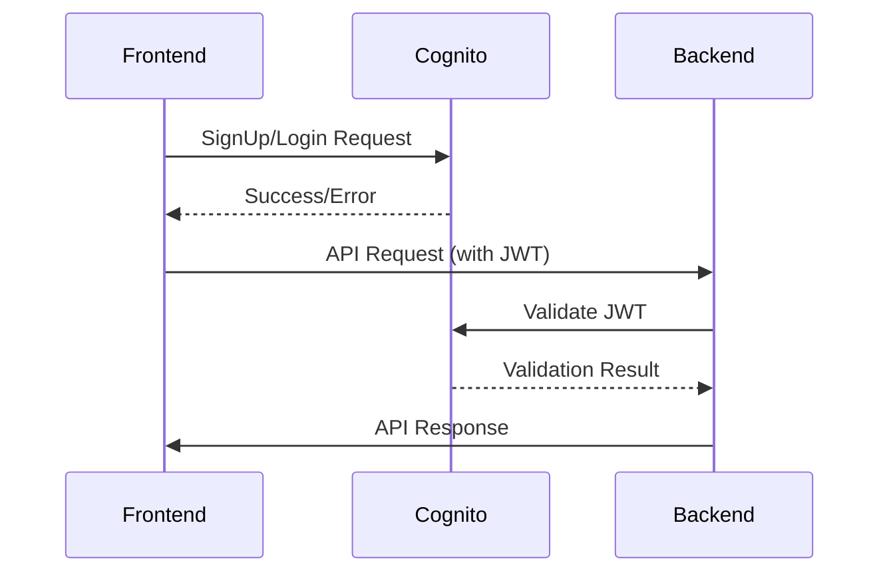

# AWS Cognito Integration Remediation Plan

## 1. Authentication Flow Audit


## 2. Critical Fixes

### Frontend Error Handling (SignUpModal.tsx)
```typescript:frontend/src/components/auth/SignUpModal.tsx
catch (err) {
  let message = 'Failed to create account';
  if (err.name === 'UsernameExistsException') {
    message = 'Email already registered';
  } else if (err.name === 'InvalidPasswordException') {
    message = 'Password must contain uppercase, number, and special character';
  } else if (err.name === 'InvalidParameterException') {
    message = 'Invalid email format';
  }
  setError(message);
}
```

### Backend JWT Validation
```javascript:backend/shared/authMiddleware.js
const { CognitoJwtVerifier } = require('aws-jwt-verify');

const verifier = CognitoJwtVerifier.create({
  userPoolId: process.env.COGNITO_USER_POOL_ID,
  tokenUse: 'id',
  clientId: process.env.COGNITO_CLIENT_ID
});

module.exports = async (req, res, next) => {
  const token = req.headers.authorization?.split(' ')[1];
  if (!token) return res.status(401).json({ error: 'Unauthorized' });

  try {
    req.user = await verifier.verify(token);
    next();
  } catch (err) {
    console.error('JWT verification failed:', err);
    res.status(401).json({ error: 'Invalid token' });
  }
};
```

## 3. Security Implementation

### Secrets Management
```bash:Terminal
# Create secure parameter
aws ssm put-parameter \
  --name "/asic-margin/alpha-vantage-api-key" \
  --value "HC5LJW21H36WULAK" \
  --type SecureString
```

### IAM Role Configuration
```yaml:template.yaml
Policies:
  - Version: '2012-10-17'
    Statement:
      - Effect: Allow
        Action:
          - secretsmanager:GetSecretValue
        Resource: arn:aws:secretsmanager:*:*:secret:asic-margin/*
      - Effect: Allow
        Action:
          - cognito-idp:AdminGetUser
        Resource: arn:aws:cognito-idp:*:*:userpool/*
```

## 4. Validation Checklist
```markdown
- [ ] New user signup succeeds with valid credentials
- [ ] Login returns valid JWT for verified accounts
- [ ] Backend rejects API requests with invalid JWTs
- [ ] CloudWatch shows detailed auth error logs
- [ ] API keys are retrieved from Secrets Manager
- [ ] IAM roles have least-privilege permissions
```

## 5. Error Logging Implementation
```javascript:backend/shared/logger.js
const winston = require('winston');
const CloudWatchTransport = require('winston-aws-cloudwatch');

const logger = winston.createLogger({
  transports: [
    new CloudWatchTransport({
      logGroupName: 'ASIC-Margin-Auth',
      logStreamName: 'backend',
      awsConfig: {
        region: process.env.AWS_REGION
      }
    })
  ]
});

module.exports = logger;
```

## Next Steps
1. Create Cognito User Pool with email verification
2. Configure App Client with `USER_PASSWORD_AUTH`
3. Deploy updated backend with auth middleware
4. Update frontend environment variables